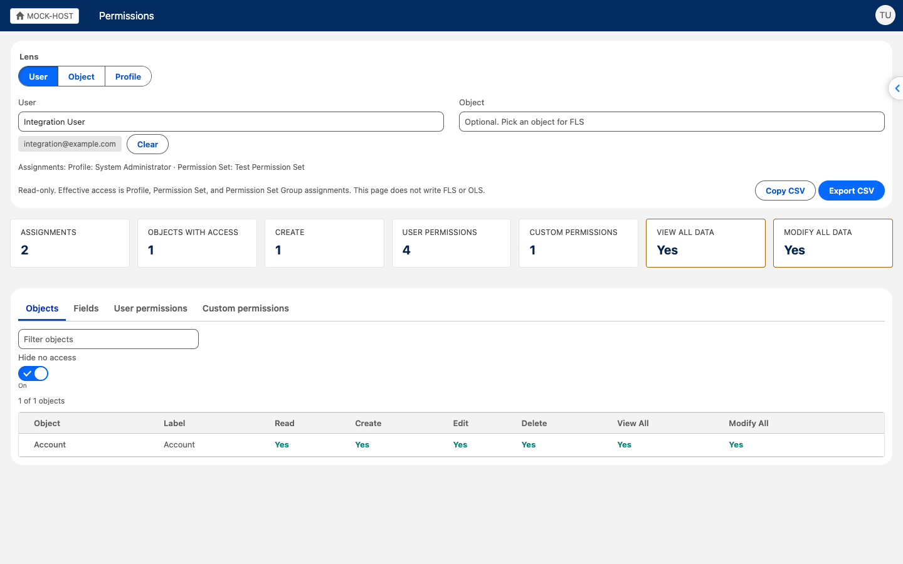

# Permissions

The Permissions page is a read-only summary of object, field, user, and custom permissions. It is faster to search and export than Setup User Access Summary and Object Access.

Open it from the popup **Data & Metadata** section, or from the Chrome command **Permissions**.

## Lenses

**User.** Pick a user. The page shows effective object access from the profile, permission sets, and permission set groups, plus user permissions and custom permissions. Each granted cell lists the source labels. Pick an object to see field-level security for that user.

**Object.** Pick an object. The page loads every profile, permission set, and permission set group that has an `ObjectPermissions` row for that object. Add extra columns if you need them. Open the Fields tab for an FLS matrix.

**Profile.** Pick a profile, or search a permission set. The page shows that parent's object, user, and custom permissions. Pick an object for FLS.

## Tabs

- **Objects.** CRUD, View All, and Modify All.
- **Fields.** Read and Edit. Limited to fields the current Inspector user can describe.
- **User permissions.** System permissions such as View All Data, with granted-by labels.
- **Custom permissions.** Granted custom permissions and their sources.

## Export

**Copy CSV** and **Export CSV** download the filtered tables: objects, fields, user permissions, and custom permissions.

The page does not write FLS, OLS, or assignments. Field Creator remains the write path for new-field FLS.

## Limits

- Effective access is an OR of Profile, Permission Set, and Permission Set Group rows. It is not sharing, restriction rules, or tab settings.
- Permission set groups appear as the aggregate permission set. Member sets and muting rows are not listed.
- Missing `ObjectPermissions` or `FieldPermissions` rows display as no access.
- Non-permissionable describe fields display as Always.
- `describe` only returns fields the current Inspector user can see.
